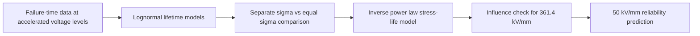
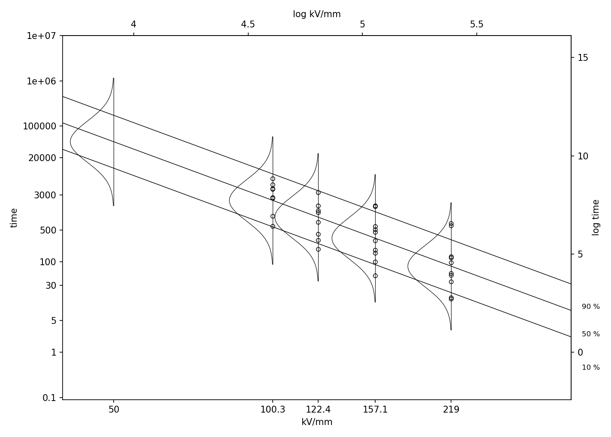

# Project Summary

This project investigates insulation lifetime using accelerated life testing.

Three Lognormal lifetime models were compared using MLE and AIC.

Although the equal-sigma model achieved the lowest AIC, it cannot extrapolate to normal operating stress.

Therefore an inverse power law model was constructed to estimate reliability at 50 kV/mm.

Sensitivity analysis further showed that the highest stress level (361.4 kV/mm) substantially influenced the extrapolated B10 and B50 life estimates, both measured in minutes.

The entire workflow was implemented in Python with reproducible reports, automated figures and unit tests.

---

# Accelerated Life Testing Reliability Analysis

A reproducible Python project for **Lognormal accelerated life testing (ALT)**, model comparison, and reliability extrapolation for electrical insulation lifetime data.

This project starts from a full-data accelerated life testing analysis, then evaluates how the highest voltage stress level affects the inverse power law extrapolation to a lower normal-use voltage level of **50 kV/mm**.

The main engineering goal is to estimate reliability quantities at 50 kV/mm:

- `F(10000 minutes)`: predicted failure probability by 10,000 minutes
- `t_0.1` / B10 life: time in minutes by which 10% of units are expected to fail
- `t_0.5` / B50 life: median lifetime in minutes

The original analysis was developed in R and refactored into a structured Python project with modular source code, automated tests, generated model reports, and R-style reliability visualizations.

---

## Project Highlights

- Fits Lognormal lifetime models under multiple voltage stress levels.
- Compares **separate-sigma**, **equal-sigma**, and **inverse power law** models using maximum likelihood estimation and AIC.
- Uses the inverse power law model to extrapolate reliability behavior to **50 kV/mm**.
- Investigates how the highest stress level, **361.4 kV/mm**, affects the inverse power law slope and the final normal-use prediction.
- Reports engineering reliability metrics: **F(10000)**, **B10 life**, and **B50 / median life**.
- Reproduces R-style reliability plots with transformed axes for engineering interpretation.
- Provides a reproducible Python workflow with `src/`, `reports/`, and `tests/`.

---

## Why Accelerated Life Testing?

In reliability engineering, products may take a long time to fail under normal-use conditions. Waiting for failures at normal stress can be impractical, so accelerated life testing applies higher stress levels to induce failures faster.

The engineering goal is not only to describe high-stress failures, but also to infer reliability under a lower normal-use condition.

In this project, insulation lifetime is observed at the following voltage stress levels:

```text
100.3, 122.4, 157.1, 219.0, and 361.4 kV/mm
```

The analysis then extrapolates to:

```text
50 kV/mm
```

which represents the lower normal-use voltage level considered in the reliability analysis.

---

## Engineering Questions

This project is organized around four reliability questions:

1. **Lifetime distribution**  
   Can Lognormal lifetime models describe failure times at each observed voltage level?

2. **Common dispersion**  
   Can the voltage groups share a common log-scale standard deviation?

3. **Stress-life relationship**  
   Does the inverse power law model provide a reasonable relationship between voltage stress and lifetime?

4. **Normal-use prediction**  
   At 50 kV/mm, what are the estimated failure probability by 10,000 minutes, B10 life in minutes, and B50 life in minutes?

---

## Modeling Workflow

The analysis separates the modeling task into two layers:



This distinction is important:

- The **equal-sigma model** evaluates whether the observed stress groups can reasonably share a common dispersion parameter.
- The **inverse power law model** imposes a stress-life relationship so that the model can extrapolate to an unobserved voltage level such as 50 kV/mm.
- The **361.4 kV/mm group is not removed at the beginning**. The full-data model is fitted first. Then the highest stress level is examined because it strongly affects the inverse power law slope and the 50 kV/mm extrapolation.

---

## Dataset

The dataset contains complete failure-time observations from an accelerated life testing experiment.

| Column | Description |
|---|---|
| `unit_id` | Unit identifier |
| `voltage_kv_mm` | Voltage stress level in kV/mm |
| `failure_time` | Observed failure time in minutes |
| `event` | Failure indicator; all observations are treated as observed failures |

This project assumes no right censoring, consistent with the original analysis.

---

## Models

### 1. Separate-Sigma Lognormal Model

Each voltage level has its own Lognormal location and scale parameter:

```text
T | V_j ~ Lognormal(mu_j, sigma_j)
```

This is the most flexible observed-data model, but it uses more parameters.

### 2. Equal-Sigma Lognormal Model

Each voltage level has its own location parameter, but all voltage levels share a common log-scale standard deviation:

```text
T | V_j ~ Lognormal(mu_j, sigma)
```

This model tests whether lifetime dispersion can be treated as common across stress levels.

### 3. Inverse Power Law Model

To extrapolate to an unobserved voltage level, the Lognormal location parameter is modeled as a function of voltage:

```text
log(T) = beta0 + beta1 * log(V) + error
```

equivalently,

```text
mu(V) = beta0 + beta1 * log(V)
```

This model enables reliability prediction at 50 kV/mm.

The inverse power law assumption means that the Lognormal location parameter should follow an approximately linear relationship with `log(V)`. Therefore, the stress-life plots and probability plots are used not only for presentation, but also for checking whether the extrapolation model is reasonable.

---

## Step 1: Observed-Data Model Comparison

The Python implementation first reproduces the full-data numerical results of the original R analysis.

| Model | Purpose | Number of Parameters | -2 Log-Likelihood | AIC |
|---|---|---:|---:|---:|
| Separate sigma | Flexible Lognormal fit for each voltage group | 10 | 564.9022 | 584.9022 |
| Equal sigma | Lognormal fit with common dispersion | 6 | 567.2105 | 579.2105 |
| Inverse power law | Stress-life relationship for extrapolation | 3 | 579.7550 | 585.7550 |

The **equal-sigma model has the lowest AIC** for the observed accelerated stress data.

However, the equal-sigma model alone cannot extrapolate to 50 kV/mm because it estimates separate mean parameters only at the observed voltage levels. Therefore, the inverse power law model is used specifically for model-based extrapolation.


---

## Step 2: Full-Data Extrapolation to 50 kV/mm

Using all stress levels, the inverse power law model produces the following normal-use reliability estimates at 50 kV/mm:

| Quantity | Estimate | Interpretation |
|---|---:|---|
| `F(10000)` | 0.0028 | Estimated failure probability by 10,000 minutes |
| `t_0.1` / B10 life | 58,541.8 minutes | Estimated time in minutes by which 10% of units fail |
| `t_0.5` / B50 life | 267,657.6 minutes | Estimated median lifetime in minutes |

The 50 kV/mm probability plot marks the reference time `10000` because the analysis evaluates the predicted failure probability at that operating time, measured in minutes.


---

## Step 3: Sensitivity to the Highest Stress Level

The highest stress level, **361.4 kV/mm**, is far from the lower stress levels and has very short failure times. Because the inverse power law model estimates a straight-line relationship between `log(V)` and log lifetime, this highest stress group can strongly affect the fitted slope.

This does not mean the 361.4 kV/mm data are automatically invalid. Instead, it shows that the inverse power law extrapolation is sensitive to the highest stress level.

For this reason, the analysis is repeated after excluding 361.4 kV/mm.

| Case | `F(10000 minutes)` | `t_0.1` / B10 life | `t_0.5` / B50 life |
|---|---:|---:|---:|
| All stress levels | 0.0028 | 58,541.8 minutes | 267,657.6 minutes |
| Excluding 361.4 kV/mm | 0.0762 | 11,699.5 minutes | 44,921.4 minutes |

The difference is substantial. Including 361.4 kV/mm produces a much more optimistic 50 kV/mm prediction, while excluding it gives a higher estimated failure probability by time 10000 and shorter B10 / B50 lifetime estimates.

This sensitivity is the central modeling issue in the project.

### Extrapolation excluding 361.4 kV/mm


### Stress-life quantile plot excluding 361.4 kV/mm

After excluding the highest stress level, the stress-life quantile plot focuses on the lower stress range used for the reduced-stress extrapolation. This figure is more consistent with the final sensitivity-based engineering interpretation than the all-stress-level stress-life plot.

The vertical normal density curves are drawn on the log-time scale and horizontally scaled for visualization.



---

## Reliability Metrics: F(10000), B10, and B50

The final output is expressed in reliability quantities rather than only model parameters. All lifetime quantities in this project are measured in minutes.

- **F(10000 minutes)** answers: *What fraction of units are expected to fail by 10,000 minutes?*
- **B10 life** (`t_0.1`) answers: *At what time, in minutes, have 10% of units failed?*
- **B50 life** (`t_0.5`) is the median lifetime, or the time in minutes by which 50% of units have failed.

These metrics translate the fitted ALT model into quantities that are easier to interpret for engineering decision-making.

---

## Reliability Visualizations

The project preserves the R-style reliability plots from the original analysis. Many figures are drawn on transformed coordinates while displaying original-scale labels for readability.

For example:

- actual plotting coordinates may use `log(time)`, `log(kV/mm)`, or standard normal quantiles;
- bottom and left axes display original-scale engineering quantities;
- top and right axes display transformed-scale values.

This design is useful because reliability probability plots are easier to assess on transformed scales, while engineering interpretation is easier on original scales.

### Equal-Sigma Probability Plot

This plot checks whether a common-sigma Lognormal model can reasonably describe the lifetime distributions across voltage stress levels.


### Inverse Power Law Residual Diagnostics

The standardized residual plot evaluates the inverse power law model using the model's own estimated sigma:

```text
z_i = [log(t_i) - beta0 - beta1 * log(v_i)] / sigma_IPL
```

Points highlighted in red indicate observations with large standardized residuals.


---

## Generated Outputs

Running `python main.py` regenerates the model summaries, predictions, residual diagnostics, and all figures.

### Reports

| File | Description |
|---|---|
| `reports/model_summary.csv` | Model comparison results, including log-likelihood and AIC |
| `reports/prediction_50kv.csv` | 50 kV/mm prediction using all stress levels |
| `reports/prediction_50kv_excluding_361_4.csv` | 50 kV/mm prediction excluding 361.4 kV/mm |
| `reports/inverse_power_law_residuals.csv` | Standardized residual diagnostics |

### Figures

| Figure | Purpose |
|---|---|
| `01_r_raw_scatter_voltage_time.png` | Raw voltage versus failure time scatter plot |
| `02_r_log_scatter_with_included_excluded_regression.png` | Log-log scatter plot with regression lines including and excluding 361.4 kV/mm |
| `03_r_probability_plot_separate_sigma.png` | Lognormal probability plot with separate-sigma fits |
| `04_r_probability_plot_equal_sigma.png` | Lognormal probability plot with equal-sigma fits |
| `05_r_probability_plot_overlay_separate_and_equal_sigma.png` | Comparison of separate-sigma and equal-sigma probability plot fits |
| `06_r_probability_plot_50kv_ci_all_stress_levels.png` | 50 kV/mm extrapolation with confidence bands using all stress levels |
| `07_r_stress_life_quantiles_all_stress_levels.png` | Full-data stress-life plot with lifetime quantile lines |
| `08_r_standardized_residuals_inverse_power.png` | Standardized residual diagnostics for the inverse power law model |
| `09_r_residual_probability_plot_equal_sigma.png` | Probability plot of residuals based on the equal-sigma model |
| `10_r_probability_plot_50kv_ci_excluding_361_4.png` | 50 kV/mm extrapolation after excluding 361.4 kV/mm |
| `11_r_stress_life_quantiles_excluding_361_4.png` | Stress-life quantile plot after excluding 361.4 kV/mm |
| `supplemental_model_comparison_aic.png` | Supplemental AIC comparison chart for quick presentation |

---

## How to Run

Install dependencies:

```bash
pip install -r requirements.txt
```

Run the full analysis:

```bash
python main.py
```

Run tests:

```bash
python -m pytest
```

Expected test result:

```text
1 passed
```

---

## Repository Structure

```text
accelerated-life-testing-reliability-analysis/
│
├── README.md
├── requirements.txt
├── main.py
│
├── data/
│   └── insulation_lifetime_data.csv
│
├── src/
│   ├── data_loader.py
│   ├── lognormal_models.py
│   ├── inverse_power_law.py
│   ├── model_selection.py
│   ├── r_style_visualizations.py
│   └── utils.py
│
├── tests/
│   └── test_reliability_results.py
│
└── reports/
    ├── model_summary.csv
    ├── prediction_50kv.csv
    ├── prediction_50kv_excluding_361_4.csv
    ├── inverse_power_law_residuals.csv
    └── figures/
```

---

## Engineering Interpretation

The analysis supports the following interpretation:

1. The equal-sigma Lognormal model provides a parsimonious fit for the observed accelerated stress data.
2. The common-sigma assumption is useful because it reduces model complexity while retaining reasonable fit across voltage groups.
3. The inverse power law model is required for extrapolation because the equal-sigma model does not define lifetime behavior at unobserved voltage levels.
4. The 361.4 kV/mm group strongly affects the inverse power law slope, making the 50 kV/mm extrapolation sensitive to high-stress observations.
5. The predicted `F(10000 minutes)`, B10 life, and B50 life translate the statistical model into engineering reliability metrics.
6. The reduced-stress extrapolation excluding 361.4 kV/mm is emphasized as the main engineering interpretation, while the all-stress result is retained as a sensitivity comparison.

---

## Limitations

- The data are treated as complete failure observations with no right censoring.
- The inverse power law model is used for extrapolation even though it does not have the lowest AIC for observed-data fit.
- Excluding 361.4 kV/mm is a modeling judgment based on sensitivity of the inverse power law extrapolation; it does not prove the data are invalid.
- Extrapolation to 50 kV/mm is model-based and should not be interpreted as direct empirical evidence.
- Confidence bands are based on asymptotic approximations.
- Additional physical knowledge would be needed before using the extrapolated results for final engineering decisions.

---

## Future Improvements

Potential extensions include:

- Add right-censored data support.
- Compare Lognormal and Weibull lifetime distributions.
- Add Arrhenius or Eyring acceleration models.
- Add bootstrap confidence intervals for extrapolated reliability estimates.
- Add formal influence diagnostics for high-stress observations.
- Build an interactive dashboard for reliability prediction.

---

## Skills Demonstrated

This project demonstrates:

- Reliability engineering analysis
- Accelerated life testing modeling
- Maximum likelihood estimation
- Lognormal lifetime modeling
- Model comparison using AIC and likelihood-based methods
- Inverse power law acceleration modeling
- Model-based extrapolation
- B10 and B50 lifetime interpretation
- Residual diagnostics
- Sensitivity analysis
- Python refactoring from R
- Reproducible project organization with tests
