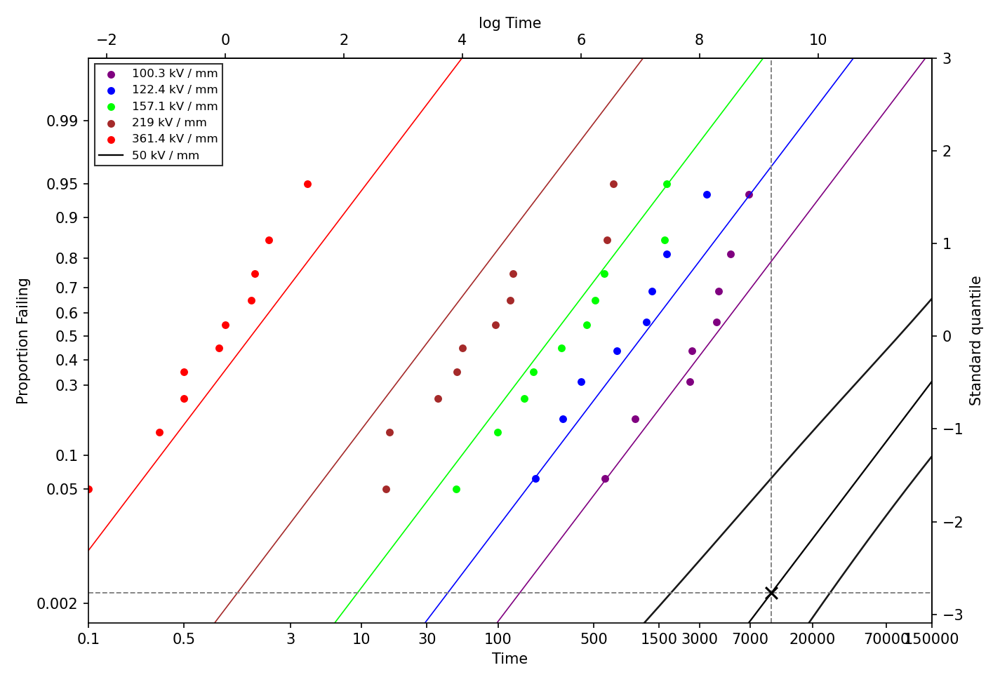
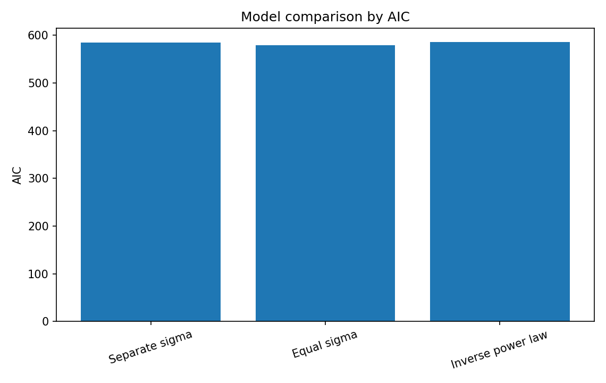
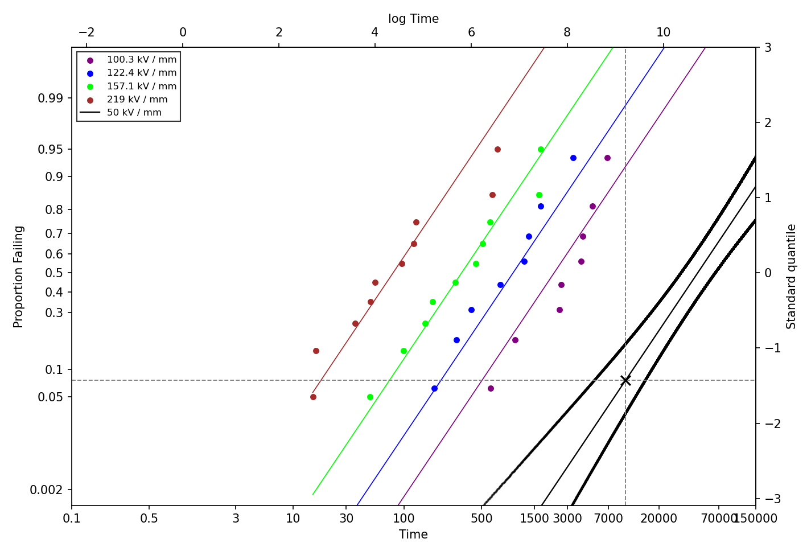
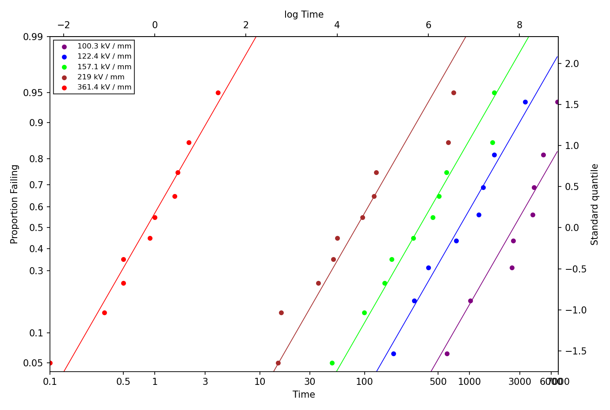
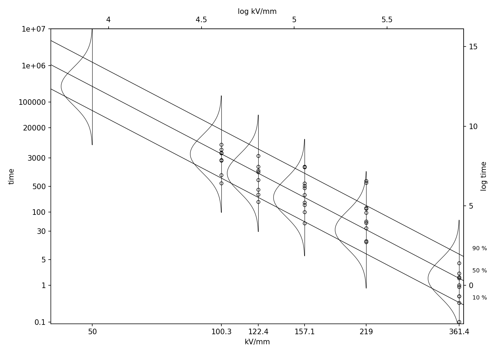
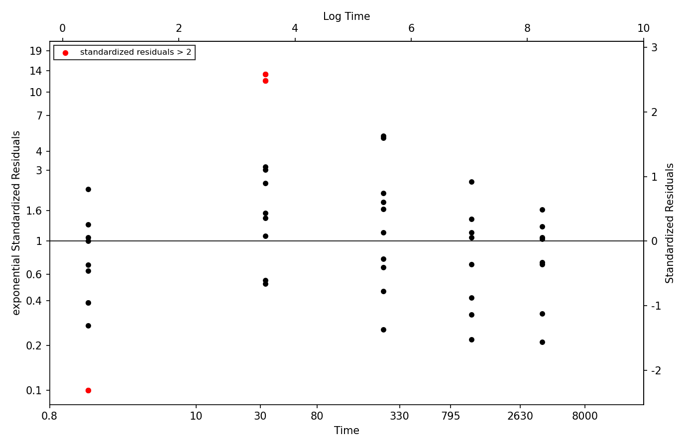

# Accelerated Life Testing Reliability Analysis


A reproducible Python project for **Lognormal accelerated life testing (ALT)**, model comparison, and normal-use reliability prediction for electrical insulation lifetime data.

This project evaluates lifetime behavior under accelerated voltage stress, compares competing Lognormal reliability models, and extrapolates reliability metrics to a lower normal-use voltage level of **50 kV/mm**.



---

## Key Results

### Normal-use reliability prediction at 50 kV/mm

| Quantity | Estimate | Engineering interpretation |
|---|---:|---|
| `F(10000)` | 0.0028 | Estimated failure probability by time 10000 |
| `t_0.1` / B10 life | 58541.8 | Estimated time by which 10% of units fail |
| `t_0.5` / B50 life | 267657.6 | Estimated median lifetime |

### Model comparison

| Model | Number of Parameters | -2 Log-Likelihood | AIC | Role |
|---|---:|---:|---:|---|
| Separate sigma | 10 | 564.9022 | 584.9022 | Flexible observed-data fit |
| Equal sigma | 6 | 567.2105 | 579.2105 | Best AIC among observed-stress models |
| Inverse power law | 3 | 579.7550 | 585.7550 | Stress-life extrapolation model |

The **equal-sigma Lognormal model** provides the most parsimonious fit for the observed accelerated stress levels, while the **inverse power law model** is used to extrapolate reliability behavior to 50 kV/mm.



---

## Project Motivation

In reliability engineering, products may take a long time to fail under normal-use conditions. Accelerated life testing applies higher stress levels so that failures can be observed sooner, then uses statistical modeling to infer reliability under lower normal-use conditions.

In this project, insulation lifetime data are observed at:

```text
100.3, 122.4, 157.1, 219.0, and 361.4 kV/mm
```

The engineering objective is to estimate reliability behavior at:

```text
50 kV/mm
```

The original analysis was developed in R and refactored into a reproducible Python project with modular source code, automated tests, generated reports, and R-style reliability visualizations.

---

## Engineering Questions

This project answers four reliability questions:

1. **Lifetime distribution**  
   Can Lognormal lifetime models describe failure times at each observed voltage level?

2. **Common dispersion**  
   Can voltage stress groups share a common log-scale standard deviation?

3. **Stress-life relationship**  
   How does lifetime change as voltage stress changes?

4. **Normal-use prediction**  
   At 50 kV/mm, what are the estimated `F(10000)`, B10 life, and B50 life?

---

## Modeling Workflow

The analysis separates lifetime modeling from acceleration modeling.


This distinction is important:

- The **equal-sigma model** evaluates whether the observed voltage groups can reasonably share a common dispersion parameter.
- The **inverse power law model** imposes a stress-life relationship so that the model can extrapolate to an unobserved voltage level.

---

## Dataset

The dataset contains complete failure-time observations from an accelerated life testing experiment.

| Column | Description |
|---|---|
| `unit_id` | Unit identifier |
| `voltage_kv_mm` | Voltage stress level in kV/mm |
| `failure_time` | Observed failure time |
| `event` | Failure indicator; all observations are treated as observed failures |

This project assumes no right censoring, consistent with the original analysis.

---

## Models

### 1. Separate-sigma Lognormal model

Each voltage level has its own Lognormal location and scale parameter:

```text
T | V_j ~ Lognormal(mu_j, sigma_j)
```

This is the most flexible observed-data model, but it uses more parameters.

### 2. Equal-sigma Lognormal model

Each voltage level has its own location parameter, but all voltage levels share a common log-scale standard deviation:

```text
T | V_j ~ Lognormal(mu_j, sigma)
```

This model tests whether lifetime dispersion can be treated as common across stress levels.

### 3. Inverse power law model

To extrapolate to an unobserved voltage level, the Lognormal location parameter is modeled as a function of voltage:

```text
log(T) = beta0 + beta1 * log(V) + error
```

equivalently,

```text
mu(V) = beta0 + beta1 * log(V)
```

This model enables reliability prediction at 50 kV/mm.

---

## Normal-Use Reliability Prediction

The inverse power law model translates accelerated life testing results into reliability quantities at 50 kV/mm.

In reliability terminology:

- **F(10000)** answers: *What fraction of units are expected to fail by time 10000?*
- **B10 life** answers: *When have 10% of units failed?*
- **B50 life** is the median lifetime.

The probability plot marks the reference time `10000` because the original engineering analysis evaluates the predicted failure probability at that operating time.


---

## Sensitivity to the Highest Stress Level

The highest stress level, **361.4 kV/mm**, strongly influences the inverse power law extrapolation. The project therefore includes a sensitivity analysis excluding this group.

| Case | `F(10000)` | `t_0.1` / B10 life | `t_0.5` / B50 life |
|---|---:|---:|---:|
| All stress levels | 0.0028 | 58541.8 | 267657.6 |
| Excluding 361.4 kV/mm | 0.0762 | 11699.5 | 44921.4 |

The difference is substantial, showing that normal-use reliability estimates are sensitive to high-stress observations and acceleration-model assumptions.



---

## Reliability Visualizations

The project preserves R-style reliability plots from the original analysis. Many figures are drawn on transformed coordinates while displaying original-scale labels for engineering interpretation.

For example:

- actual plotting coordinates may use `log(time)`, `log(kV/mm)`, or standard normal quantiles;
- bottom and left axes display original-scale engineering quantities;
- top and right axes display transformed-scale values.

### Equal-sigma probability plot

This plot checks whether a common-sigma Lognormal model can reasonably describe lifetime distributions across voltage stress levels.



### Stress-life quantile plot

This plot shows estimated lifetime quantile curves across voltage levels, including B10, B50, and B90-type behavior. The vertical normal density curves are drawn on the log-time scale and horizontally scaled for visualization.



### Inverse power law residual diagnostics

The standardized residual plot evaluates the inverse power law model using the model's own estimated sigma:

```text
z_i = [log(t_i) - beta0 - beta1 * log(v_i)] / sigma_IPL
```

Points highlighted in red indicate observations with large standardized residuals.



---

## Generated Outputs

Running `python main.py` regenerates all model summaries, predictions, residual diagnostics, and figures.

### Reports

| File | Description |
|---|---|
| `reports/model_summary.csv` | Model comparison results, including log-likelihood and AIC |
| `reports/separate_sigma_parameters.csv` | Parameter estimates for separate-sigma Lognormal models |
| `reports/equal_sigma_parameters.csv` | Parameter estimates for the equal-sigma Lognormal model |
| `reports/inverse_power_law_parameters.csv` | Inverse power law parameter estimates |
| `reports/prediction_50kv.csv` | 50 kV/mm prediction using all stress levels |
| `reports/prediction_50kv_excluding_361_4.csv` | 50 kV/mm prediction excluding 361.4 kV/mm |
| `reports/inverse_power_law_residuals.csv` | Standardized residual diagnostics |
| `reports/figure_catalog.csv` | Catalog of generated figures |

### Figures

| Figure | Purpose |
|---|---|
| `01_r_raw_scatter_voltage_time.png` | Raw voltage versus failure time scatter plot |
| `02_r_log_scatter_with_included_excluded_regression.png` | Log-log scatter plot with regression lines including and excluding 361.4 kV/mm |
| `03_r_probability_plot_separate_sigma.png` | Lognormal probability plot with separate-sigma fits |
| `04_r_probability_plot_equal_sigma.png` | Lognormal probability plot with equal-sigma fits |
| `05_r_probability_plot_overlay_separate_and_equal_sigma.png` | Comparison of separate-sigma and equal-sigma probability plot fits |
| `06_r_probability_plot_50kv_ci_all_stress_levels.png` | 50 kV/mm extrapolation with confidence bands |
| `07_r_stress_life_quantiles_all_stress_levels.png` | Stress-life plot with lifetime quantile lines |
| `08_r_standardized_residuals_inverse_power.png` | Standardized residual diagnostics for the inverse power law model |
| `09_r_residual_probability_plot_equal_sigma.png` | Probability plot of residuals based on the equal-sigma model |
| `10_r_probability_plot_50kv_ci_excluding_361_4.png` | 50 kV/mm extrapolation after excluding 361.4 kV/mm |
| `11_r_stress_life_quantiles_excluding_361_4.png` | Stress-life quantile plot after excluding 361.4 kV/mm |
| `supplemental_model_comparison_aic.png` | Supplemental AIC comparison chart for presentation |

---

## How to Run

Install dependencies:

```bash
pip install -r requirements.txt
```

Run the full analysis:

```bash
python main.py
```

Run tests:

```bash
python -m pytest
```

Expected test result:

```text
1 passed
```

---

## Repository Structure

```text
accelerated-life-testing-reliability-analysis/
│
├── README.md
├── LICENSE
├── requirements.txt
├── main.py
│
├── data/
│   └── insulation_lifetime_data.csv
│
├── src/
│   ├── data_loader.py
│   ├── lognormal_models.py
│   ├── inverse_power_law.py
│   ├── model_selection.py
│   ├── r_style_visualizations.py
│   └── utils.py
│
├── tests/
│   └── test_reliability_results.py
│
└── reports/
    ├── model_summary.csv
    ├── prediction_50kv.csv
    ├── prediction_50kv_excluding_361_4.csv
    ├── inverse_power_law_residuals.csv
    └── figures/
```

---

## Engineering Interpretation

The analysis supports the following interpretation:

1. The equal-sigma Lognormal model provides a parsimonious fit for the observed accelerated stress data.
2. The common-sigma assumption reduces model complexity while retaining reasonable fit across voltage groups.
3. The inverse power law model is required for extrapolation because the equal-sigma model does not define lifetime behavior at unobserved voltage levels.
4. The predicted `F(10000)`, B10 life, and B50 life translate the statistical model into engineering reliability metrics.
5. Excluding the highest stress level changes extrapolated predictions substantially, showing that normal-use reliability estimates are sensitive to high-stress observations and acceleration-model assumptions.

---

## Limitations

- The data are treated as complete failure observations with no right censoring.
- The inverse power law model is used for extrapolation even though it does not have the lowest AIC for observed-data fit.
- Extrapolation to 50 kV/mm is model-based and should not be interpreted as direct empirical evidence.
- Confidence bands are based on asymptotic approximations.
- Additional physical knowledge would be needed before using the extrapolated results for final engineering decisions.

---

## Future Improvements

Potential extensions include:

- Add right-censored data support.
- Compare Lognormal and Weibull lifetime distributions.
- Add Arrhenius or Eyring acceleration models.
- Add bootstrap confidence intervals for extrapolated reliability estimates.
- Add formal influence diagnostics for high-stress observations.
- Build an interactive dashboard for reliability prediction.

---

## Skills Demonstrated

This project demonstrates:

- Reliability engineering analysis
- Accelerated life testing modeling
- Maximum likelihood estimation
- Lognormal lifetime modeling
- Model comparison using AIC and likelihood-based methods
- Inverse power law acceleration modeling
- Model-based extrapolation
- B10 and B50 lifetime interpretation
- Residual diagnostics
- Sensitivity analysis
- Python refactoring from R
- Reproducible project organization with tests
